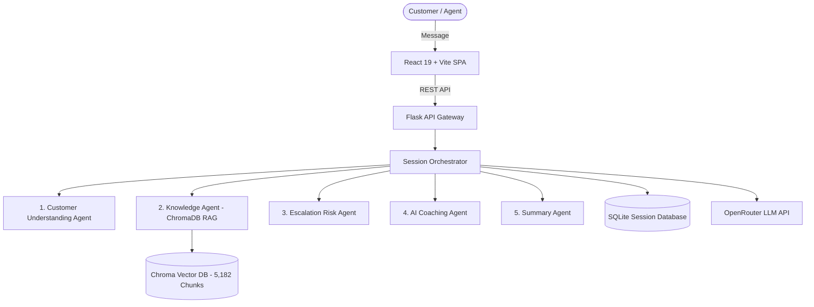

# 🎧 AI-Powered Customer Support Coaching Assistant

> An enterprise real-time AI copilot that provides instant response suggestions, 500-scenario RAG knowledge retrieval, sentiment & escalation analysis, quality monitoring, and performance analytics to supercharge customer support interactions.

---

## 🌟 Key Features

- **Multi-Agent Orchestration**:
  - **Customer Understanding Agent**: Extracts emotion, sentiment, intent, entities, and urgency in real-time.
  - **Knowledge Agent (RAG)**: Retrieves semantic chunks from 500 domain scenarios (AC, broadband, billing, refunds, delivery, authentication) using ChromaDB and Sentence Transformers.
  - **Escalation Risk Agent**: Calculates risk score percentages (0–100%) and severity tiers (*Low, Medium, High, Critical*).
  - **AI Coaching Agent**: Formulates empathetic, compliant, and actionable reply recommendations.
  - **Summary Agent**: Generates structured issue, root-cause, and resolution action items.
  - **Simulator Agent**: Generates diverse customer personas and realistic conversational follow-up turns.
  - **Memory Agent**: Maintains contextual multi-turn conversation state.
- **Enterprise React UI**:
  - **Live Coaching Copilot**: Interactive split-screen workspace with HUD telemetry and 1-click coaching reply insertion.
  - **500-Scenario Knowledge Base Explorer**: Semantic search across indexed PDF scenarios with in-UI vector database rebuilding.
  - **Audit Reports & Compliance**: Full historical session auditing, search/filter, and 1-click **CSV** and **JSON** exports.
  - **Real-Time Analytics**: Visual quality distribution charts, sentiment trends, and risk metrics.
  - **Dark / Light Mode**: Seamless theme switching with high-contrast accessible typography.
- **Cloud-Ready Architecture**:
  - Unified Flask backend serving compiled React Single Page Application (SPA) on a single port (`http://localhost:5000` / `0.0.0.0:$PORT`) with **zero CORS issues**.
  - 1-click Render blueprint (`render.yaml`), `Procfile`, and `start_production.bat`.

---

## 🏗️ Architecture



---

## 🚀 Quick Start (Local Run)

### Option 1: 1-Click Launch (Windows)
Double-click [`start_production.bat`](start_production.bat) in the project folder.

### Option 2: Terminal Commands
```powershell
# 1. Build React Frontend
cd frontend
npm install
npm run build

# 2. Start Flask Unified Server
cd ../backend
.\.venv\Scripts\Activate.ps1
python app.py
```
> Open your browser at **`http://localhost:5000`** to access the complete live platform.

---

## ☁️ Cloud Deployment (Render)

See full instructions in [**`DEPLOYMENT.md`**](DEPLOYMENT.md).

### Quick Render Settings:
- **Environment**: Python
- **Build Command**: `npm --prefix frontend install && npm --prefix frontend run build && pip install -r requirements.txt`
- **Start Command**: `gunicorn --chdir backend app:app --workers 1 --threads 4 --timeout 120 --bind 0.0.0.0:$PORT`
- **Environment Variables**:
  - `PYTHON_VERSION`: `3.11.9`
  - `OPENROUTER_API_KEY`: `your_openrouter_api_key`
  - `MODEL_NAME`: `nvidia/nemotron-3-nano-30b-a3b:free`
